# 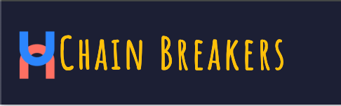
## Introduction

## **Hack for Hope: Submission Details**  

### **Deployment**   
The project is deployed and can be accessed at: [Chain Breakers Live Site](https://chain-breaker-a367b4614472.herokuapp.com/)

The team's Kanban board: [GitHub Project Board](https://github.com/trxdave/chain-breaker1.git)

---

Welcome to Chain Breakers! We are Hack to Hope, and this project was created as part of the "Code to Protect" hackathon in January 2025 hosted by Code Institute. This hackathon is aligned with National Slavery and Human Trafficking Prevention Month, and our goal is to shine a light on the realities of human trafficking and empower communities to recognize and respond to potential red flags.

Our project focuses on interactive trafficking scenarios designed to raise awareness and educate users about the warning signs of human trafficking. By presenting realistic situations, we aim to teach people how to identify troubling patterns and learn effective ways to seek help or intervene. Ultimately, we believe that knowledge is a powerful tool in preventing exploitation and safeguarding vulnerable individuals.

View the live site here: [Chain Breakers](https://chain-breaker-a367b4614472.herokuapp.com/)

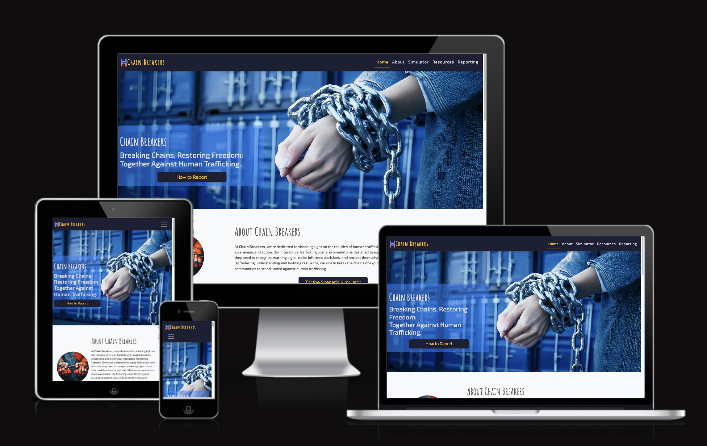

---

## Table of Contents
1. [Overview](#overview)
2. [Key Features](#key-features)
3. [User Experience (UX Design)](#user-experience-ux-design)
4. [Pages](#pages)
5. [Technologies Used](#technologies-used)
6. [Deployment](#deployment)
7. [Testing](#testing)
8. [Future Development Plans](#future-development-plans)
9. [Team](#team)
10. [Credits](#credits)
11. [Acknowledgement](#acknowledgement)

---

## Overview

**Chain Breakers** is a barrier-free informational platform dedicated to raising awareness about modern slavery and human trafficking. With a focus on ease of access, our site requires no user accounts or logins—ensuring that critical information and reporting tools are available to everyone without any obstacles.

### Key Features

- **Realistic Scenarios**: Explore situation-based examples that highlight common red flags and forms of exploitation, helping individuals recognize warning signs.
- **Educational Resources**: Access infographics and statistics to deepen understanding of human trafficking and how to combat it.
- **Open Access**: All content and tools on **Chain Breakers** are publicly available—no sign-ups or personal information required.
- **Responsive Design**: The platform is optimized for all major browsers and devices, providing a seamless experience anytime, anywhere.

---

### User Experience (UX Design)

#### User Stories

- As a user, I want to easily navigate the site so that I can find information quickly.
- As a concerned individual, I want to learn about the signs of human trafficking so that I can help identify potential victims.
- As an educator, I want to access resources and scenarios to teach others about human trafficking.
- As a volunteer, I want to find organizations and hotlines to offer my support.

---

### Pages

#### Home Page

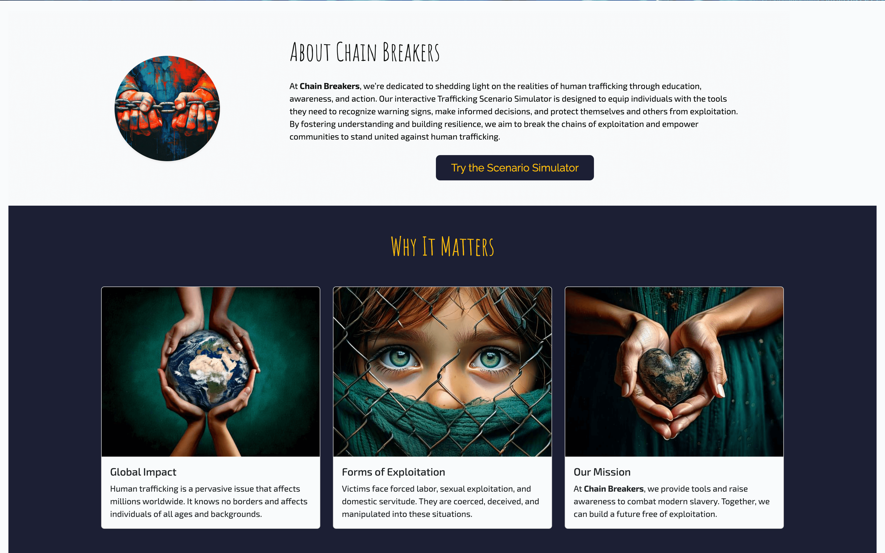

#### About Page

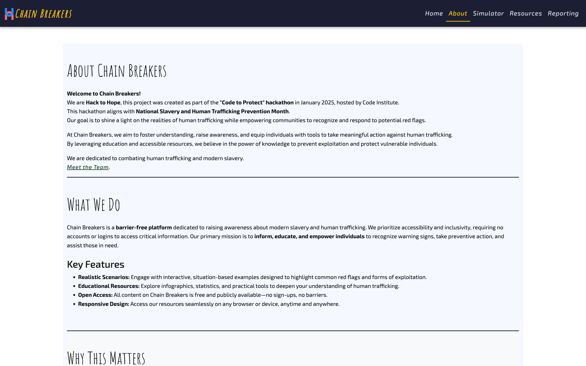

#### Simulator Page

#### Resources Page

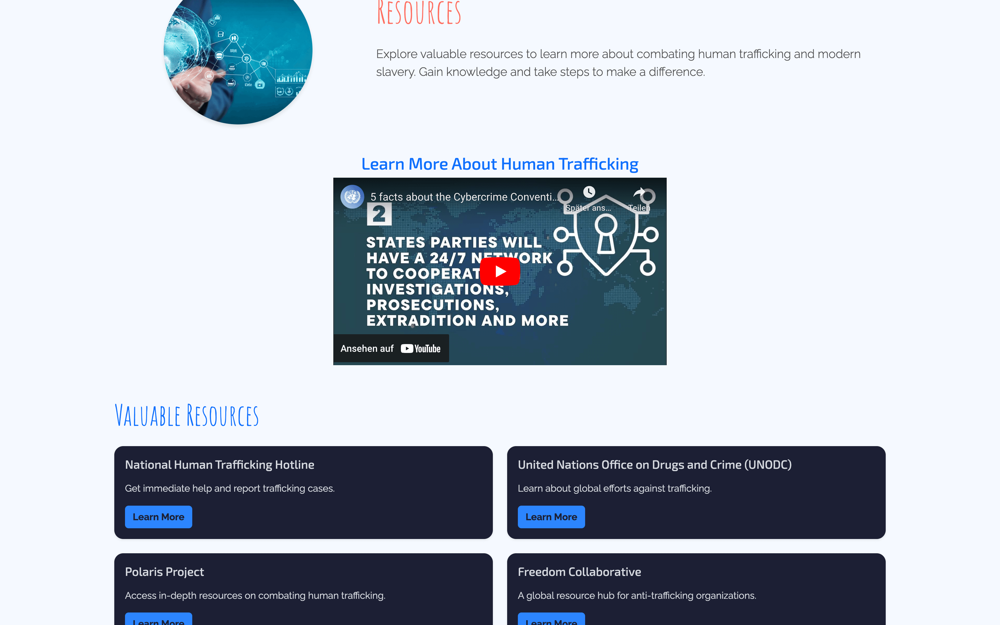

#### Reporting Page

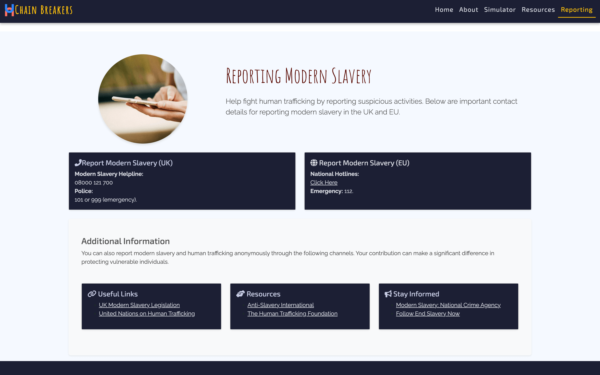

#### Meet the Team Page

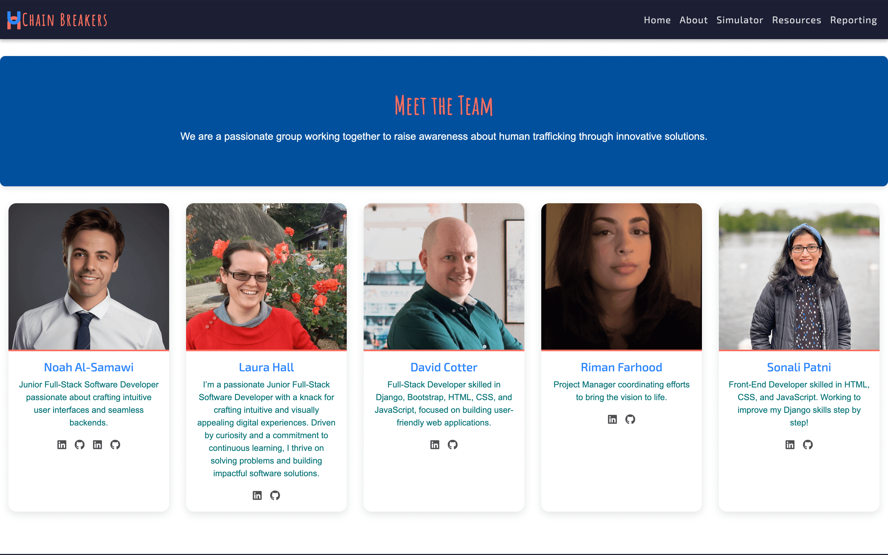

### Wireframes

Here are the wireframes for the main pages of the project:

- **Homepage**  
  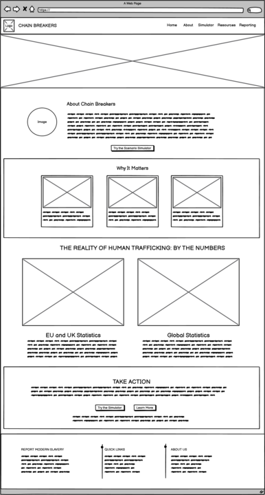

- **About Page**  
  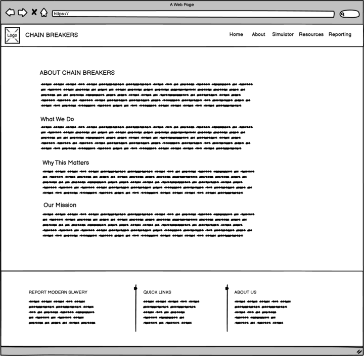

- **Resources Page**  
  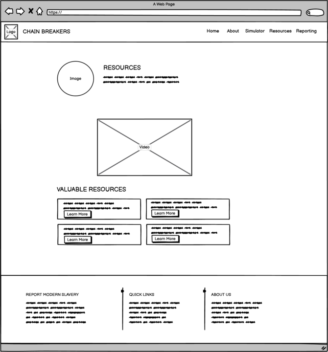

- **Simulator Page**  
  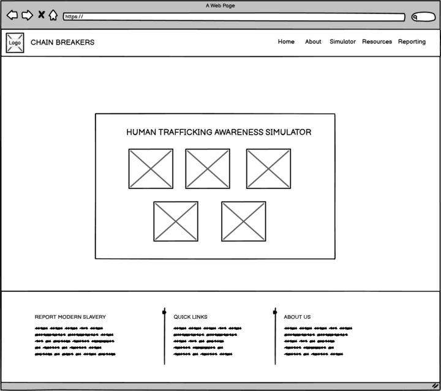

- **Reporting Page**  
  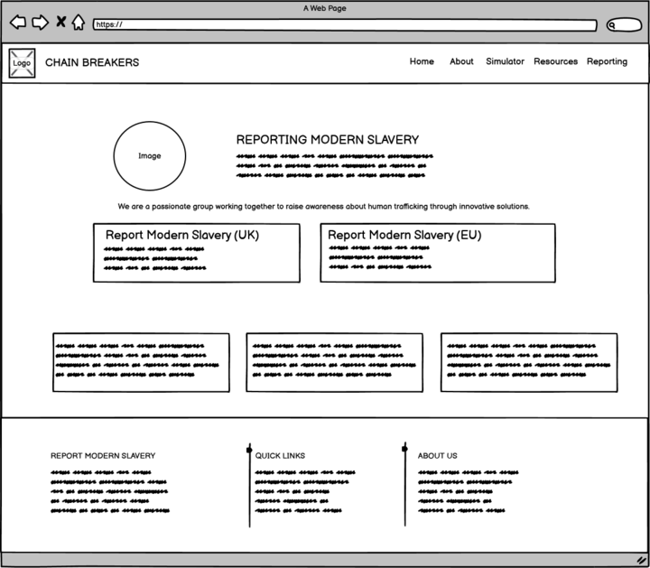

- **Meet the Team Page**  
  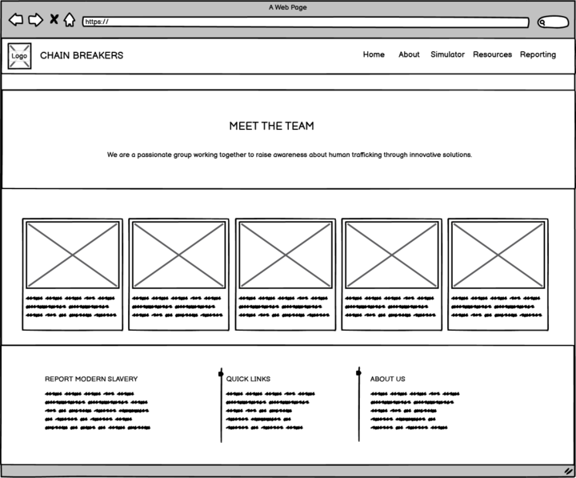

---

## Technologies Used

**Chain Breakers** leverages a combination of modern web technologies to deliver a seamless and engaging user experience. The primary technologies used in this project include:

### 💻 Tech Stack  
- **Frontend**: HTML, CSS, JavaScript  
- **Version Control**: Git & GitHub  
- **Deployment**: Heroku  
- **Other Tools**: 
  - Bootstrap CDN - [Bootstrap Docs](https://getbootstrap.com/docs/5.3/getting-started/introduction/)
  - [Font Awesome CDN](https://cdnjs.com/libraries/font-awesome)
  - [Google Fonts](https://fonts.google.com)
  - [Three.js](https://threejs.org/)

#### Frameworks, Libraries, and Programs

- **Django**: For backend development.
- **React**: For dynamic and responsive components.
- **Bootstrap**: For responsive design.

---

## Deployment

### GitHub Deployment

GitHub is used for version control and collaboration. The codebase for **Chain Breakers** is hosted on GitHub, allowing contributors to submit pull requests for review.

### Heroku Deployment

Heroku provides robust infrastructure for deployment. The deployment process includes:
1. Creating a Heroku app.
2. Connecting the GitHub repository.
3. Configuring environment variables.
4. Deploying the app.

---

## Testing

### Lighthouse Testing

We use Lighthouse for performance, accessibility, and SEO audits to ensure a high-quality user experience.

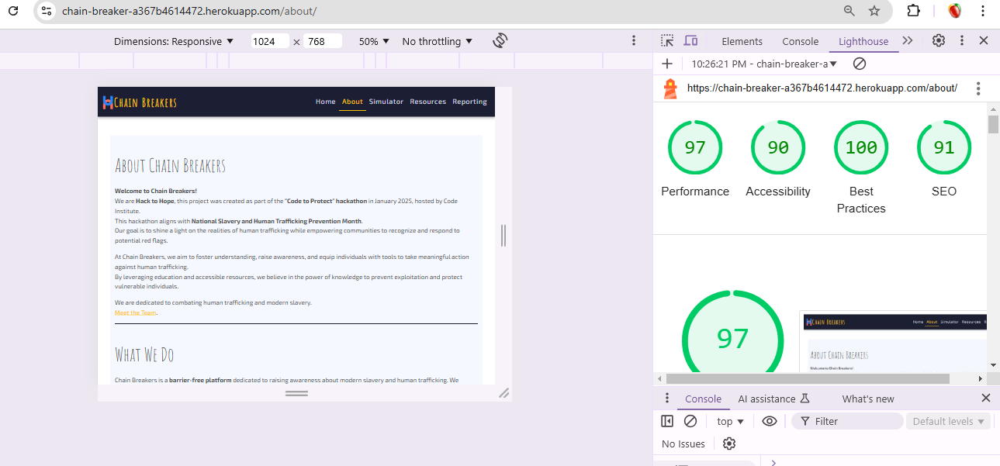

### Manual Testing

Manual testing was conducted on various devices and browsers to ensure compatibility and responsiveness.

### Automated Testing

Unit tests, integration tests, and end-to-end tests were implemented to ensure the codebase remains stable.

---

### Homepage Colors  

The homepage uses a carefully curated color palette to ensure accessibility, readability, and aesthetic appeal. Each color in the palette has a specific role, enhancing the user experience through visual hierarchy and design consistency.

- **Platinum (#D6D9E0):** A soft neutral shade used for background elements.  
- **Davy's Gray (#4F4F4F):** A dark gray tone utilized for text or secondary components.  
- **Space Cadet (#1C1F33):** A deep blue for headers and primary accents.  
- **Amber (#FFC107):** A vibrant yellow to highlight calls to action and interactive elements.  
- **Bittersweet (#FF6F61):** A warm red for attention-grabbing components, such as alerts or buttons.

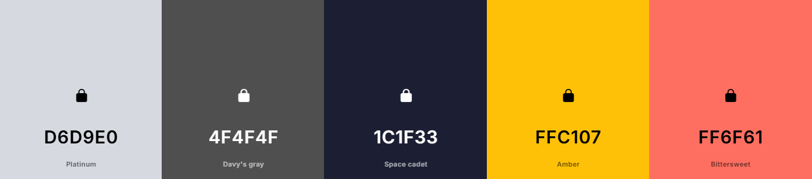

---

## Future Development Plans

- **Expanded Scenario Library**: More nuanced situations covering various forms of trafficking and exploitation.
- **Comprehensive Resource Directory**: A curated list of hotlines, organizations, and campaigns.
- **Localization**: Offer content in multiple languages.
- **Offline Access Options**: Features for downloading or printing critical information.

---

## Team

- [Noah Al-Samawi](https://github.com/Noah-Samawi)
- [David Cotter](https://github.com/trxdave) 
- [Riman Farhood](https://github.com/rimanfarhood)
- [Laura Hall](https://github.com/laurachri-hall)
- [Sonali Patni](https://github.com/SonaliP11)

---

## Credits

We utilized a variety of tools and platforms to create and enhance our project. Here's a breakdown:
- **[Venngage Infographics](https://infograph.venngage.com/):** To create engaging and visually appealing infographics.
- **Photoshop:** For editing and enhancing pictures.
- **Adobe Firefly:** Generating AI-based graphics and visuals.
- **[favicon.io](https://favicon.io/):** Creating the project's favicon.
- **[logo.com](https://logo.com/):** Designing the project logo.
- **Perplexity AI:** Assisting with content creation and research.
- **ChatGPT:** Contributing to content generation and editing.
- **[Pexels](https://pexels.com/):** Source for the resources and reporting images used in the project.
These tools collectively helped us bring our vision to life with a polished and professional finish.
logo.comlogo.com
Logo Maker | Create a free logo in minutes | LOGO.com
LOGO.com’s #1 rated logo maker is fun, easy to use, and free. Create custom logos with unlimited designs to choose from. Over 200 million logos generated! (16 kB)
https://logo.com/):**

---

## Acknowledgement

We extend our heartfelt gratitude to the following:

- **Code Institute**: For organizing the "Code to Protect" hackathon.
- **Hack to Hope Team**: For their dedication and hard work.
- **Subject Matter Experts**: For their invaluable insights on human trafficking and modern slavery.
